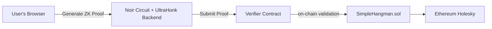

# ZK Hangman dApp

A complete zkDapp version of the classic Hangman game built with [Noir](https://noir-lang.org/), Solidity, and a JavaScript frontend.

This project demonstrates how to use Zero Knowledge proofs to:

1. **Prevent frontrunning**: by binding the winner’s address as a public input in the ZK proof.
2. **Enforce valid inputs**: by verifying that the secret word contains only alphabetic characters.
3. **Keep the secret word hidden**: on-chain only the proof and commitments are stored, never the plaintext.

We build and connect three main components:

1. A **Noir circuit** that validates and hashes the secret word.
2. A **Solidity verifier contract** that checks ZK proofs on-chain.
3. A **Web3-powered frontend** to generate proofs and interact with the contracts.

---

## Architecture



---

## Prerequisites

- [Node.js](https://nodejs.org/) (v20+)
- [Bun](https://bun.sh/) (for package management and dev server)
- [MetaMask](https://metamask.io/) or any EVM-compatible wallet
- Holesky testnet (Network ID: `17000`)
- `noirup` (for Noir toolchain)
- `bb` (Aztec CLI for proof & verifier generation)

---

## Setup & Installation

1. **Clone the repo**
   ```bash
   git clone https://github.com/yourusername/zk-hangman.git
   cd zk-hangman
   ```

2. **Install dependencies**
   ```bash
   npm install
   ```

3. **Compile Noir circuit & generate verifier**
   ```bash
   # Compile the circuit
   nargo compile

   # Generate verification key & Solidity verifier
   bb write_vk -b target/zk_hangman.json -o target --oracle_hash keccak
   bb write_solidity_verifier -k target/vk -o circuits/Verifier.sol
   ```

4. **Deploy contracts**
   - Deploy `circuits/Verifier.sol` first to your Holesky network.
   - Deploy `contracts/SimpleHangman.sol`, passing the verifier address to the constructor.

5. **Configure frontend**
   - Update `web3_stuff.js` with your deployed `CONTRACT_ADDRESS`.

---

## Usage

Start the development server:

```bash
bunx vite
```

1. Open your browser at `http://localhost:5173`.
2. Connect your wallet to Holesky.
3. As **Admin**: set the secret word (max 10 letters) to initialize the game.
4. As **Player**: guess the word—your address will be bound in the proof to prevent frontrunning.
5. View logs and proof details in the UI.


---

## Project Structure

```bash
.
├── circuits/           # Noir source & Solidity verifier
│   ├── src/main.nr     # Noir circuit
│   └── Verifier.sol    # Generated verifier contract
├── contracts/          # Hangman game contract
│   └── SimpleHangman.sol
├── frontend/           # Web3 and ZK frontend
│   ├── index.html
│   ├── index.js
│   ├── zk_stuff.js
│   └── web3_stuff.js
├── target/             # Noir compilation & VK
└── README.md           # This file
```

---

## Learn More

- Noir Quick Start: https://noir-lang.org/docs/getting_started/quick_start
- Noir + Solidity example by Saleel: https://github.com/saleel/noir-solidity-example/
- My tutorial on spanish: https://dev.to/turupawn/zk-y-noir-el-tutorial-completo-5h51

---

## License

[MIT](LICENSE)

